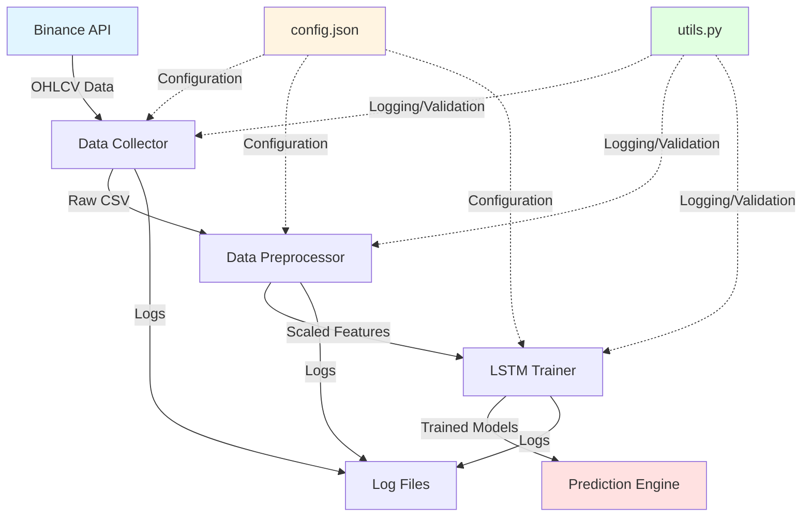
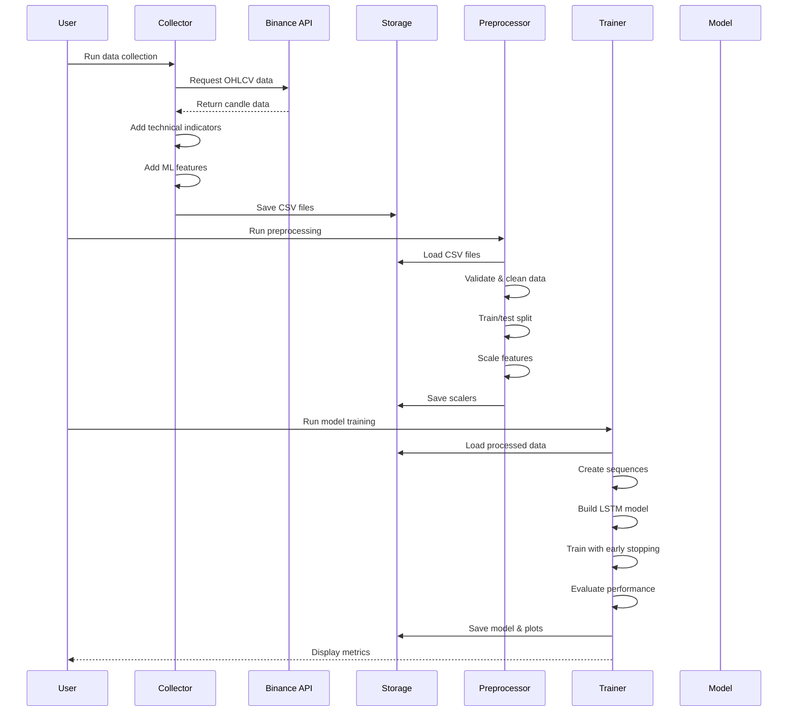

# System Architecture

## Table of Contents
1. [Overview](#overview)
2. [System Components](#system-components)
3. [Data Flow](#data-flow)
4. [Technology Stack](#technology-stack)
5. [Design Decisions](#design-decisions)
6. [Scalability](#scalability)

## Overview

The Cryptocurrency Price Prediction System is a three-stage machine learning pipeline designed to forecast cryptocurrency prices using historical data and deep learning techniques.

### High-Level Architecture



## System Components

### 1. Data Collection Module

**File**: `data_collector_enhanced.py`

**Purpose**: Fetches historical OHLCV (Open, High, Low, Close, Volume) data from Binance API and enriches it with technical indicators.

**Key Features**:
- Pagination handling for large datasets
- Automatic retry with exponential backoff
- Rate limiting to prevent API bans
- Real-time progress tracking
- Data validation and error handling

**Inputs**:
- Configuration from `config.json`
- Binance public API (no authentication required)

**Outputs**:
- CSV files with 40 columns per cryptocurrency
- Technical indicators (SMA, EMA, RSI, MACD, Bollinger Bands, OBV)
- Lag features and volatility measures
- Target variables for ML training

**Data Schema**:
```
Columns (40):
- Time: open_time, close_time
- OHLCV: open, high, low, close, volume
- Volume metrics: quote_asset_volume, taker_buy_volume, etc.
- Technical indicators: SMA_20, EMA_20, RSI_14, MACD, etc.
- Lag features: close_lag_1, close_lag_3, ..., close_lag_24
- Returns: return_1h, return_3h, return_6h
- Volatility: vol_3h, vol_6h, vol_12h, vol_24h
- Targets: target_next_close, target_up_down
```

### 2. Data Preprocessing Module

**File**: `data_preprocessing_enhanced.py`

**Purpose**: Prepares collected data for machine learning by cleaning, validating, and scaling features.

**Key Features**:
- Time-series aware train/test splitting
- Feature scaling with MinMaxScaler
- Missing value handling
- Data quality validation
- Scaler persistence for inference

**Processing Steps**:
1. Load ML-ready CSV files
2. Add time features (hour, day of week, day)
3. Create lag features if missing
4. Validate data quality
5. Split into train (80%) and test (20%) sets
6. Scale features (except time columns)
7. Scale target variable
8. Save scalers for later use

**Outputs**:
- Scaled training features
- Scaled test features
- Scaled target variables
- Persisted scaler objects (.pkl files)

### 3. Model Training Module

**File**: `model_training_enhanced.py`

**Purpose**: Trains LSTM neural networks to predict future cryptocurrency prices.

**Key Features**:
- Sequence generation for time-series data
- Multi-layer LSTM architecture
- Early stopping to prevent overfitting
- Model checkpointing
- Performance visualization
- Modern .keras model format

**Model Architecture**:
```
Input Layer: (sequence_length=48, features=34)
    ↓
LSTM Layer 1: 64 units, return_sequences=True
    ↓
Dropout: 0.2
    ↓
LSTM Layer 2: 32 units
    ↓
Dropout: 0.2
    ↓
Dense Layer: 1 unit (price prediction)
```

**Training Configuration**:
- Optimizer: Adam
- Loss Function: Mean Squared Error (MSE)
- Batch Size: 64
- Max Epochs: 40
- Early Stopping: Patience = 5
- Validation Split: 10%

**Outputs**:
- Trained models (.keras files)
- Scalers (.pkl files)
- Feature lists (.pkl files)
- Prediction plots (.png files)
- Performance metrics (MSE, MAE, R²)

### 4. Utility Module

**File**: `utils.py`

**Purpose**: Provides common functionality across all modules.

**Components**:

#### ConfigManager
- Loads and validates configuration
- Provides type-safe access to settings
- Handles missing values with defaults

#### LoggerSetup
- Configures logging to file and console
- Timestamps all log entries
- Separate log files per module

#### DataValidator
- Validates DataFrames
- Checks date ranges
- Validates symbols
- Ensures data quality

#### RetryHandler
- Implements exponential backoff
- Configurable retry attempts
- Logs retry attempts

#### FileManager
- Safe file path creation
- Directory management
- File size utilities
- Prevents directory traversal attacks

## Data Flow

### Detailed Pipeline



### Data Transformations

**Stage 1: Raw Data**
```
Binance API → Raw OHLCV candles (1000 per request)
```

**Stage 2: Feature Engineering**
```
Raw OHLCV → + Technical Indicators → + Lag Features → + Returns → + Volatility
```

**Stage 3: Preprocessing**
```
Engineered Features → Validation → Train/Test Split → Scaling → Ready for ML
```

**Stage 4: Sequence Creation**
```
Scaled Data → Sliding Windows (48-hour sequences) → 3D Arrays for LSTM
```

**Stage 5: Model Training**
```
Sequences → LSTM Training → Predictions → Inverse Scaling → Evaluation
```

## Technology Stack

### Core Technologies

| Component | Technology | Version | Purpose |
|-----------|-----------|---------|---------|
| Language | Python | 3.8+ | Primary programming language |
| Data Processing | Pandas | 2.0+ | Data manipulation |
| Numerical Computing | NumPy | 1.24+ | Array operations |
| Machine Learning | Scikit-learn | 1.3+ | Preprocessing & metrics |
| Deep Learning | TensorFlow | 2.13+ | LSTM model training |
| Deep Learning | Keras | 2.13+ | High-level neural network API |
| Visualization | Matplotlib | 3.7+ | Plotting and charts |
| HTTP Requests | Requests | 2.31+ | API communication |
| Serialization | Joblib | 1.3+ | Model & scaler persistence |

### Development Tools

- **Jupyter Notebook**: Interactive development and experimentation
- **Git**: Version control (recommended)
- **VS Code / PyCharm**: IDE support

### External Services

- **Binance API**: Public cryptocurrency data source
  - Endpoint: `https://api.binance.com/api/v3/klines`
  - No authentication required for public data
  - Rate limit: ~1200 requests per minute

## Design Decisions

### 1. Why LSTM?

**Rationale**: Long Short-Term Memory networks are specifically designed for sequence prediction tasks and can capture long-term dependencies in time-series data.

**Advantages**:
- Handles variable-length sequences
- Learns temporal patterns
- Resistant to vanishing gradient problem
- Proven effectiveness in financial forecasting

**Alternatives Considered**:
- GRU (Gated Recurrent Unit): Simpler but less expressive
- Transformer: More complex, requires more data
- Traditional ML (Random Forest, XGBoost): Cannot capture temporal dependencies as effectively

### 2. 48-Hour Sequence Length

**Rationale**: Balances short-term patterns with computational efficiency.

**Analysis**:
- Too short (< 24h): Misses important patterns
- Too long (> 72h): Increases training time, may include irrelevant data
- 48 hours: Captures 2 full trading days, optimal for hourly data

### 3. MinMaxScaler vs StandardScaler

**Choice**: MinMaxScaler

**Rationale**:
- LSTM with sigmoid/tanh activations work better with [0,1] range
- Preserves zero values
- Easier to interpret predictions
- More stable for financial data with outliers (after clipping)

### 4. Time-Series Split (No Shuffle)

**Rationale**: Prevents data leakage in time-series forecasting.

**Why No Shuffle**:
- Future data cannot be used to predict past
- Maintains temporal ordering
- Realistic evaluation of model performance

### 5. Configuration-Driven Architecture

**Rationale**: Separates configuration from code for flexibility.

**Benefits**:
- Easy parameter tuning
- No code changes for experiments
- Version control for configurations
- Supports multiple environments

### 6. Comprehensive Logging

**Rationale**: Production-ready systems require audit trails.

**Benefits**:
- Debugging and troubleshooting
- Performance monitoring
- Compliance and auditing
- Error tracking

## Scalability

### Current Limitations

1. **Single-threaded processing**: Processes one symbol at a time
2. **In-memory data**: All data loaded into RAM
3. **Local storage**: CSV files on disk
4. **No distributed training**: Single machine only

### Scaling Strategies

#### Horizontal Scaling

**For Data Collection**:
```python
# Use multiprocessing for parallel symbol processing
from multiprocessing import Pool

with Pool(processes=5) as pool:
    results = pool.map(process_symbol, SYMBOLS)
```

**For Model Training**:
```python
# Distribute training across GPUs
strategy = tf.distribute.MirroredStrategy()
with strategy.scope():
    model = build_model()
```

#### Vertical Scaling

**Memory Optimization**:
- Use chunked reading for large CSV files
- Implement data generators for training
- Use mixed precision training (float16)

**Compute Optimization**:
- GPU acceleration for LSTM training
- Batch processing for predictions
- Optimize sequence generation

#### Database Integration

**Replace CSV with Database**:
```python
# PostgreSQL with TimescaleDB for time-series
import psycopg2

conn = psycopg2.connect("postgresql://localhost/crypto_db")
df = pd.read_sql("SELECT * FROM ohlcv WHERE symbol='BTCUSDT'", conn)
```

#### Cloud Deployment

**AWS Architecture**:
- **S3**: Store CSV files and models
- **EC2**: Run training jobs
- **Lambda**: Scheduled data collection
- **SageMaker**: Managed model training
- **CloudWatch**: Centralized logging

**GCP Architecture**:
- **Cloud Storage**: Data and models
- **Compute Engine**: Training instances
- **Cloud Functions**: Scheduled tasks
- **Vertex AI**: ML platform
- **Cloud Logging**: Log aggregation

### Performance Optimization

**Current Performance** (single symbol):
- Data Collection: ~2-5 minutes
- Preprocessing: ~10-30 seconds
- Model Training: ~5-15 minutes

**Optimized Performance** (with improvements):
- Parallel collection: ~1-2 minutes for all symbols
- Batch preprocessing: ~5 seconds per symbol
- GPU training: ~2-5 minutes per symbol

### Future Enhancements

1. **Real-time Predictions**: WebSocket integration for live data
2. **Model Ensemble**: Combine multiple models for better accuracy
3. **Hyperparameter Tuning**: Automated optimization with Optuna
4. **Feature Selection**: Automated feature importance analysis
5. **Model Monitoring**: Track model drift and performance degradation
6. **API Service**: REST API for predictions
7. **Web Dashboard**: Interactive visualization and monitoring
8. **Backtesting**: Historical performance evaluation
9. **Risk Management**: Position sizing and stop-loss recommendations
10. **Multi-timeframe**: Support for different intervals (5m, 15m, 4h, 1d)

---

**Document Version**: 1.0  
**Last Updated**: December 15, 2025  
**Author**: System Architecture Team
